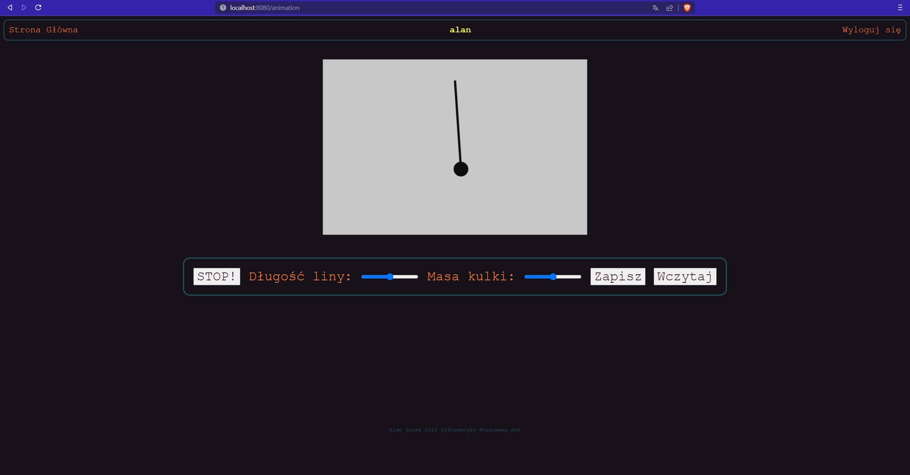

# Mathematical Pendulum
## Simple web application with animation and user database for Colleague course

## Set Up
* go to directory `backend` and run command `npm i`
* make your `.env` file with database credentials and token secrets
* in directory `backend` type command `npm run dev`